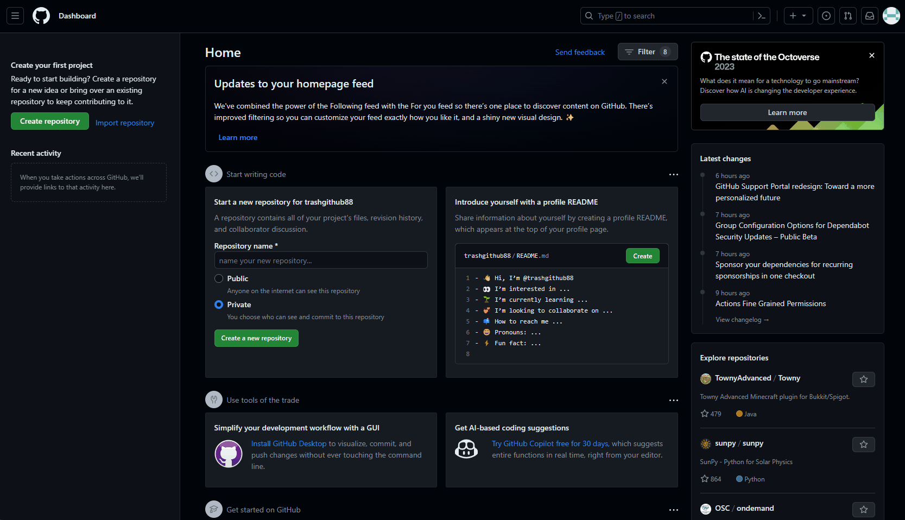
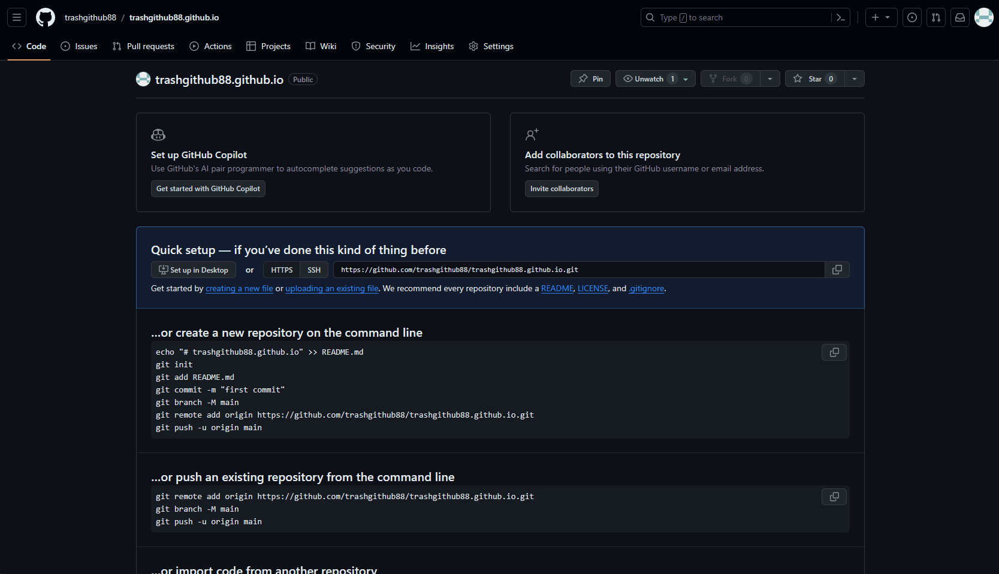
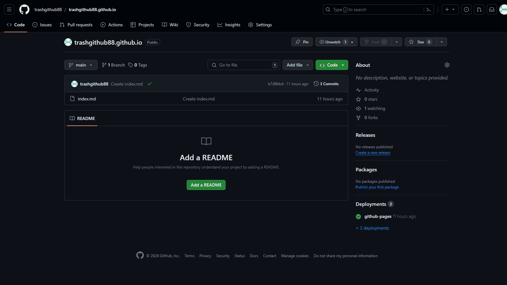
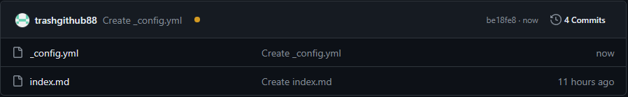
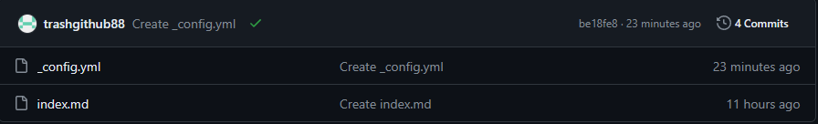
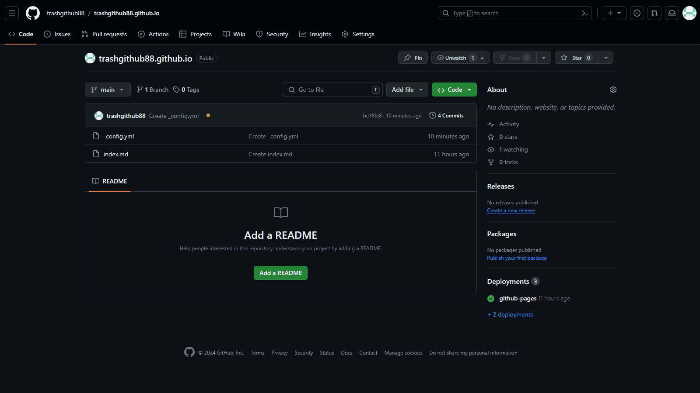

# Hosting Resume on Github

## Purpose

**Welcome to my Gif-hub guide** *(ba dum tss)* **on how to host your resume as a Github Page!**

## Prerequisites
- A Github account. You can skip to [Step 3](#step-3---using-markdown) if you already have one
- A formatted resume in Markdown. You can skip to [Step 3.5](#step-3.5---uploading-resume-onto-github-repository) if you already wrote one.

- Otherwise, please start from the beginning of the [Instructions](#instructions)

## Instructions

### Step 1 - Creating a Github account
- [Create a Github account here](https://github.com/signup?ref_cta=Sign+up&ref_loc=header+logged+out&ref_page=%2F&source=header-home)
- Type in your email, password and username. Then, Github will ask you to solve a puzzle. It can be something similar to this:


- Type in the verification code sent to your email by Github after you solved the puzzle. Once that's done, it will lead you to Github homepage

### Step 2 - Creating a repository on Github
- Click on `Create repository` *(a green button on the left side of the browswer)* and it will redirect you to a new page. The new page shows the `Owner *` (your username) and `Repository name *` text box
- Type the text box underneath `Repository name *` in this format.
```
yourUsername.github.io
```
- e.g, My burner account has the username of **trashgithub88**. I will name repository.
```
trashgithub88.github.io
```
- Click `Create repository` at the bottom of the screen once that's done.



### Step 3 - Using Markdown
- Make a markdown file by clicking `creating a new file` in the Quick setup section. It links to a web text editor.
- Fill the text box next to `yourUsername.github.io` exactly with.
```
index.md
```

- Underneath there is a hugh textbox showing *Enter file contents here*. Now, you will write your resume in Markdown language. It is very easy to learn. Here are some examples

|Syntax|Result|
|------|------|
|`**bold**`|**bold**|
|`*italic*`|*italic*|
|`***both***`|***both***|

[Learn more about Markdown syntax](https://markdownguide.offshoot.io/basic-syntax/) 
- Start off with my sample code by copying and pasting it in the text editor
```
<!--Heading 1-->
# My Name
| phone | email | fax |


<!--Heading 2-->
## About me
<!--Write about yourself-->
I am cute

## Skills
<!--Bullet points-->
- Language: Javascript, C/C++, Python, C#
- Tool: Git, VSC, Unreal Engine, Unity

<!--Make extra space between lines. Else Markdown will make everything into 1 single line-->
## Experience

<!--wrap around ** for bold | wrap around * for italic-->
**Game Dev at Activision Blizzard** - *Remote* 

Sep 1999 - Nov 2010
- Created World of Warcraft
- Created Diablo series

## Education

**Comp Sci at MIT** - *Cambridge, MA*

Sep 1995 - May 1999
- Specialized in computer graphic
- Specialized in software engineer
```
- You can switch between `Edit` and `Preview` to see how it actually looks like *(The option is at the top left corner of the text editor)*
- Play around and make changes to get familar with Markdown. Once you're satisfied with the content, click `Commit changes...` on the top right corner of the text editor.


### [Go to step 4](#step-4---hosting-on-github)

### Step 3.5 - Uploading resume onto Github repository
- Change your Markdown resume file name to `index.md`
- Upload your markdown file by clicking `Upload` in the Quick setup section.

### Step 4 - Hosting on Github
When you click `Commit changes...` from previous step, Github will automatically deploy your resume. 
- Check your Github resume page by going to `https://yourUsername.github.io/` (*remember to replace yourUsername with yours*)


### Step 5 - Applying a Jekyll theme to your resume
- Go to your repository by click your repository name on the top left of the browser. It should be `yourUsername.github.io`
- Click on `Add file` then click on `+ Create new file`. It will appear the same text editor as before. Here you will apply a theme to your resume *(index.md)*
- Type in the naming text box `_config.yml`
- Copy and paste this to the text editor
```
---
title: "Your title" # <--- change to anything you want
theme: jekyll-theme-midnight
---
```
- There are some other themes you can choose from. Heres are my recommendations

  | Some other Jekyll Theme |
  |---|
  |jekyll-theme-midnight|
  |jekyll-theme-midnight|
  |jekyll-theme-midnight|

- Click on `Commit changes...` when you're done



- Redirect yourself to your repository



The top bar shows a small yellow circle indicating your resume in being deploying after applying a new theme. After it's done, it might or might not show the green tick. 



- Click on it to see if it's finished. If it shows to be succeed, go to or refresh your Github page `https://yourUsername.github.io/` (*remember to replace yourUsername with yours*)



### Congratulation! You made it to the end. 
**Now you have yourself a Github Page Resume! And it should look like this**


## More Resources

- [My resume]()
- [More Jekyll Theme]()
- []()

## Authors and Acknowledgments

- [NhatAnh Nguyen](https://github.com/nateng98)
- group members

## FAQs

1. Is there any cost associated with hosting a page on GitHub?
    - GitHub offers free hosting for static websites through GitHub Pages. To learn more about Github pages, please go [here](https://docs.github.com/en/pages/getting-started-with-github-pages/about-github-pages)

2. Can I name my resume file differently?
    - Unfortunately, you cannot. It has to be `index.md` so Github will know that this is the file you want to be hosted as a Github page.

3. Is it necessary to apply Jekyll theme to your resume?
    - No, it is not necessary. But it will make your resume look more appealing.